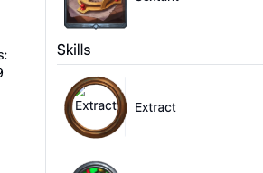

### TODOS

- [x] Fix Search image rendering
- [x] Fix tooltips. Probably better to not use the library.
- [x] Make empty card decks take up space so they don't shift layout when you add player cards
- [x] Fix weird skills that seem to be carditems instead.
      
- [x] Set battle speed, 2x, 3x etc
- [x] Add github repo link to navbar
- [x] Replace old tooltips with new floating UI tooltips
- [x] Move gold/income to separate UI component
- [x] Fix bug: having to doubleclick the red X to remove a card
- [x] Add state saving to URL. Should probably use Zustand.
- [ ] Add player config for health, level, regen, income, gold, etc.
- [ ] Add card config, to set dmg, shield etc. Which can be boosted outside of combat.
- [ ] Win percentage for RNG in battles
- [ ] Show storm damage UI
- [ ] Damage numbers above health
- [ ] Change the code to support custom monsters/encounters

## Bugged Items

- [ ] Z-Shield, no multicast
- [ ] Adrenal converter gives double Regen, Triggers do nout account for if Subject and Target is same

```
 "2": {
          "Id": "2",
          "Trigger": {
            "$type": "TTriggerOnCardPerformedPoison",
            "Subject": {
              "$type": "TTargetCardSection",
              "TargetSection": "SelfHand",
              "ExcludeSelf": false,
              "Conditions": null
            },
            "Target": {
              "$type": "TTargetPlayerRelative",
              "TargetMode": "Self",
              "Conditions": null
            }
          },
          "ActiveIn": "HandOnly",
          "Action": {
            "$type": "TActionPlayerRegenApply",
            "ReferenceValue": null,
            "Duration": {
              "$type": "TDeterminantDuration",
              "DurationType": "UntilEndOfCombat"
            },
            "Target": {
              "$type": "TTargetPlayerRelative",
              "TargetMode": "Self",
              "Conditions": null
            }
          },
          "Prerequisites": null,
          "Priority": "Medium",
          "InternalName": "Adrenal Converter 3",
          "InternalDescription": "When you Poison yourself, gain [--/10/15/20] Regen for the fight and Haste 1 item for 1 second(s).",
          "MigrationData": "2614e6d8-282a-4fe2-8d2f-ab28d4029567",
          "VFXConfig": {
            "VFXOverrideKey": "Assets/TheBazaar/Projectiles/Buffs/Regeneration/Projectile_RegenerationBuff_PV.prefab",
            "VFXShouldPlay": true,
            "VFXIsTakeover": false
          },
          "TranslationKey": "41a7b2eca74526f1e46fe71bd492cadb"
        },
```
